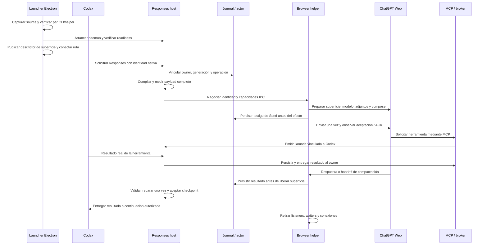

# Continuidad y diagnósticos causales — revisión de ingeniería

Fecha: 2026-10-01. Alcance: implementación local del adaptador existente, sin activar el candidato ni ejecutar compactaciones reales.

## Problema y evidencia del incidente

Los refactors previos endurecieron validación y lifecycle, pero no demostraban que el modelo emitiera el contrato solicitado ni que el runtime cargado correspondiera al código revisado. El arranque de desarrollo podía ejecutar el CLI desde source mientras el helper procedía de otro build. Un timeout de ACK además perdía su causa tipada al atravesar IPC y la frontera de compactación.

Se inspeccionaron `launcher.jsonl` y su rotación bajo los logs de Electron, además de la salud del daemon. Se extrajo estructura diagnóstica; los reportes de esta revisión no incluyen prompts, cookies, outputs ni rutas del usuario.

| Evidencia observada | Conclusión y límite |
| --- | --- |
| 2026-10-01 01:32:39 UTC, `multipart_stage_2_acknowledgement`, 180001 ms; ruta fallback | La segunda parte agotó su plazo de observación. El fallo exterior se degradó a `compaction_handoff_failed`. No demuestra si faltó generación del ACK, entrega, hidratación o extracción. No autoriza reenviar. |
| 2026-10-01 10:37:20 UTC, trace `c903fca1a660`, `missing_state`, reparación realizada | La entrada validada carecía del bloque obligatorio; apertura, cierre y campos reconocidos eran cero. La captura de superficie también observó cero tags en visible/HTML/markdown. El modelo o su representación requieren un canario; no se acredita un defecto específico de extracción sin reproducción. |
| Artefacto daemon `289e6ace…025c`, helper `14af41a0…16b7`, commit no identificado | Los incidentes pertenecen al runtime predecesor. No son evidencia de ejecución del candidato preparado. |
| Respuestas 401 en el histórico del launcher | Son errores observados de autorización. Sin endpoint, request ID y causa correlacionados no se atribuyen a la sesión del navegador ni al MCP. |

El nuevo contrato pide checkpoint v2 explícitamente, suministra el hash de origen desde el host y rechaza una referencia distinta. Esto corrige ambigüedad del prompt y procedencia; una prueba sintética no demuestra obediencia del modelo real.

## Flujo real desde el arranque hasta la entrega



1. `launcher/scripts/dev.cjs` prepara el snapshot mediante el builder nuevo. `main.cjs` y `runtime-command.cjs` usan la misma selección fijada durante la vida del launcher. El supervisor comprueba el runtime y conecta la ruta que Codex consume; abrir Codex y refrescar su catálogo son acciones separadas de la readiness del daemon.
2. El builder captura bytes de `src`, package, lockfile y tsconfig; instala el lockfile capturado en staging aislado con `--frozen-lockfile --ignore-scripts --backend=copyfile`, compila esos bytes y publica un directorio por digest mediante rename. Verifica ambos archivos y el hash del conjunto. Los módulos externos se resuelven desde una copia del snapshot; no se enlaza el `node_modules` mutable del checkout. No reemplaza el helper legacy cargado. Un árbol sucio puede tener `buildCommit: null` y aun así un par verificado; no se inventa un commit.
3. `response-route.ts` resuelve modelo/capacidades, vincula identidad nativa y observa el stream del adaptador. El listener de abort pertenece a la solicitud HTTP y se retira al terminar. Desconectar un observador no acredita cancelación del efecto compartido.
4. El compilador preserva historial y literales. Sólo contratos estáticos entran en la LRU; el hash de tarea se agrega después de consultar la caché. La reparación lleva una referencia interna calculada antes de sustituir el contexto por su prompt de reparación.
5. La selección evalúa inline, dos y seis partes con el payload físico medido. Los registros grandes se fragmentan sin cambiar sus bytes: offsets UTF-8, longitudes y hashes de fragmento y registro. El host reconstruye y verifica antes del envío; el modelo recibe texto legible, no base64. Un helper sin la capacidad requerida se rechaza antes de autorizar Send.
6. El actor persiste preparación y activación de Send. Sin resultado final, un efecto enviado o ambiguo queda incierto. La ausencia de resultado no autoriza relanzarlo. El journal sigue siendo la autoridad de recuperación y consumo de continuaciones.
7. El worker monta diagnósticos sobre la página arrendada, retira los listeners anteriores al rebind y desmonta los del turno en `finally`. DOM, progreso externo y red despiertan la observación; la FSM y el completion fence conservan la autoridad de finalización.
8. MCP conserva fases distintas para recepción, claim, emisión a Codex, resultado ejecutado y respuesta transportada. Una respuesta enviada no constituye por sí misma evidencia de ejecución. La cancelación retira la correlación aunque nunca llegue una respuesta.
9. La compactación comparte normalización, parsing, validación, reparación acotada, persistencia, aceptación y entrega. Una continuación durable requiere owner, generación, source y hash exactos. No se inventan requisitos ni resultados verificados.

## Arquitectura de observabilidad

`src/diagnostics` es un módulo interno independiente del resultado funcional. Los productores generan eventos v2 con ID, secuencia por productor, reloj UTC de ocurrencia, reloj monotónico, identidad de runtime y correlaciones. El sink añade `writtenAt` al escribir: ocurrencia y persistencia no son el mismo instante.

Los errores viajan como DAG v1 con IDs conservados, causa y errores agregados. La serialización admite causas primitivas, ciclos y getters hostiles sin filtrar datos arbitrarios. El parser rechaza identidades remotas inválidas; no las sustituye por la identidad del receptor. Los grafos compartidos se recorren con trabajo acotado y se verifica la profundidad máxima y los ciclos.

El vocabulario de causas es cerrado. Se conservan códigos I/O nativos, syscalls permitidos, status, retryable y mediciones de selección (`expectedValue`, `observedValue`, rango e índice). Mensajes desconocidos, stacks, cookies, paths y contenido del usuario no cruzan esta frontera. Una causa desconocida permanece desconocida; no se deduce de una frase.

| Recurso | Presupuesto / comportamiento |
| --- | --- |
| DAG de error | 16 KiB, profundidad 8, hasta 16 hijos agregados por nodo; flags explícitos de truncado |
| Ring por timeline | 256 eventos / 1 MiB, contadores de captura, descarte y expulsión |
| Cola del sink | 256 registros / 1 MiB; no acumula trabajo ilimitado |
| Segmento privado | PID + generación + UUID de instancia; hasta 5 archivos de 10 MiB por writer |
| Retención de writers muertos | 7 días / 128 MiB; conserva writers vivos, journals y locks ambiguos |
| Lectura de archivos | no-follow, nonblocking, archivos regulares; límites de archivos, bytes y registros |
| Flush de cierre | deadline de 1000 ms; la observabilidad no cambia el resultado de la tarea |
| Fallo del sink | circuito acotado, health actual y contadores históricos separados; fallback estructurado a stderr |

`/healthz` publica `diagnostic_health` además de la salud de telemetría existente. El preflight suma ambos presupuestos y bloquea colas pendientes, degradación y fallos. Si un runtime anuncia health causal malformado, el bootstrap legacy tampoco puede ocultarlo. La ausencia de seams del predecesor sigue el gate legacy existente.

Los locks legacy ambiguos se conservan. La recuperación de locks identificados exige propietario comprobablemente muerto y runtime inactivo. Los nuevos writers usan segmentos exclusivos y no compiten por ese lock compartido.

## Decisiones, riesgos y revisión

Clasificación R2×L por concurrencia compartida, efectos de navegador y recuperación durable. Se mantienen transporte, autoridades de sesión/journal, nombres públicos MCP, checkpoint v2 y close con abort.

La implementación fue dividida entre recovery, transporte, diagnósticos y startup. Recovery y transporte se integraron por commits; los últimos dos slices se recuperaron y verificaron en el árbol principal tras el límite de uso de sus agentes. La revisión independiente encontró seis errores adicionales en errores/identidad, reproducidos y corregidos. Su rereview comprobó causas primitivas, nombres hostiles, DAG compartido, manifiestos y rechazo de identidad remota.

No se verificó aislamiento mecánico R/A/V ni se produjeron firmas independientes. La evidencia local y el ledger no representan aprobación formal de release; la revisión humana requerida por SHS sigue pendiente antes de merge o activación. No se declara un canario exitoso a partir de replay.

Las nuevas capturas son estructurales y sanitizadas. Screenshots siguen siendo opt-in y pueden contener contenido visible de la tarea; deben revisarse antes de compartirlos. No se inicia tracing global del BrowserContext.

## Artefactos, dependencias y gates

El gate de continuidad utiliza ahora `buildDevelopmentRuntime` y registra hashes de los archivos que ejecutaría el launcher. Se eliminó la receta in-memory con todos los packages externos: no era el mismo artefacto y podía producir una falsa discrepancia al preparar el canario. La regresión ejecuta el builder con una fixture y compara los bytes efectivos. El gate de rollback ahora exige CLI y helper con hashes de manifiesto verificados, un commit exacto y la presencia de una copia física de dependencias si se declara. No acepta un helper aislado y un archivo de texto como rollback. Este control no reemplaza el smoke del rollback ni identifica retroactivamente el grafo source del proceso viejo.

El audit del lock raíz pasó de un advisory moderado a cero al fijar Hono 4.13.7. El del launcher pasó de nueve hallazgos a cero con overrides de brace-expansion 1.1.21, 2.1.7 y 5.0.12, conservando sus versiones mayores. Referencias: [Hono](https://github.com/advisories/GHSA-hxh3-vqpv-xpqv), [brace-expansion](https://github.com/advisories/GHSA-q2hr-2g5m-vwhr). Estos hallazgos transitivos no acreditan que el flujo de esta aplicación sea explotable.

Se actualizó únicamente el lock de los checkouts activos. Sus dependencias instaladas permanecen anteriores hasta una ventana legítima; los candidatos usan el lock nuevo en staging aislado. Un audit del lock no demuestra qué módulo está cargado en el proceso viejo.

El recibo actual estará en `docs/evidence/harness-continuity-verification.json`; los recibos de 98bef09 se archivan con ese sufijo. El manifiesto del candidato identifica ambos bundles y el conjunto. Ni las mediciones replay ni una smoke de readiness reemplazan canarios de ChatGPT Web.

## Cómo verificar y continuar

```bash
bun run typecheck
bun run lint
bun run check:refactor-gates
bun test ./tests --coverage --coverage-reporter=lcov --coverage-dir=/tmp/cgw-coverage
node --test launcher/tests/*.test.cjs
CHATGPT_DOM_TEST_BROWSER=/usr/bin/google-chrome bun run test:browser-contracts
bun run scripts/check-harness-continuity.ts --samples=5 --report=/tmp/cgw-gates.json
bun run scripts/build-development-runtime.ts
```

El builder prepara un candidato y no activa servicios. No ejecutar `build:bundles`, `deploy`, restart o shutdown sobre el runtime activo. Los hashes y resultados de esta entrega están en el recibo de evidencia enlazado desde el handoff.

Pendiente operativo: una ventana inactiva demostrada, revisión formal, 20 compactaciones reales con continuación y cobertura retained/fallback, y dos sesiones con trabajo efectivo estrictamente mayores de 22 minutos. Deben medirse fidelidad, éxito de tarea, recursos y eficiencia por separado. Si un canario falla, detener la expansión y restaurar el artefacto anterior preservando journals y diagnósticos.
