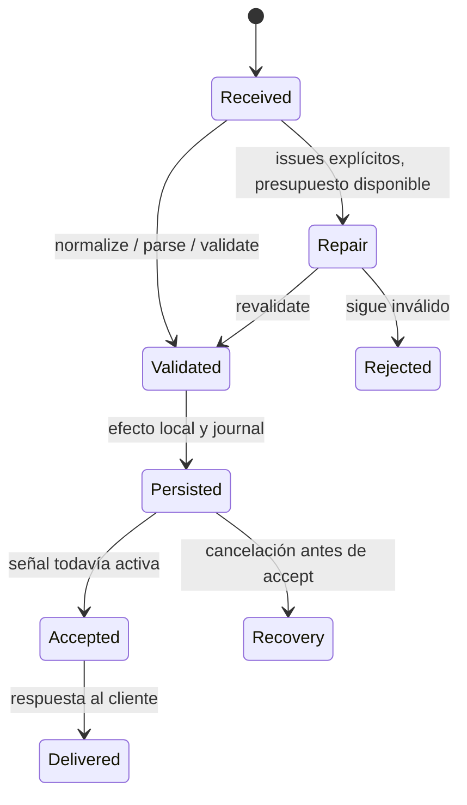

# Harness continuity: pruebas y operación

Alcance B: replay determinista en Chromium, continuidad coding, lifecycle y gates.
Producción y regresiones específicas pertenecen a A. No commits ni despliegues desde B.
Clasificación SHS: R2×M por concurrencia; workspace compartido, sin aislamiento
mecánico demostrado. Revisión humana antes de merge; estos tests no certifican rollout.

## Contratos para A (inspección inicial)

- Reutilizar `SubmissionObserver`, `ResponseObserver`, `TurnDiagnostics` y
  `ChatGptLunaCheckpointStore`; el replay ejecuta sus métodos, sin copias del algoritmo.
- Send físico vive actualmente en `ChatGptBrowserWorker.sendAttachedPrompt` (privado).
  Para verificar NO resend se necesita ese camino real: preferible una API exportada
  de envío; mientras tanto se usa el worker construido por `makeWorkerFixture`.
- `ChatGptTurnEventBus.pendingWaiters` ya existe. Para contar timers/listeners/feeds
  y transacciones contra baseline se necesita una API diagnóstica pública, inmutable,
  con contadores de recursos activos. No se leerán mapas privados.
- Un runtime cerrado debe rechazar nuevos waits, incluso con historial, y abort
  debe ganar al replay. La pérdida del ACK termina por deadline explícito; no habilita Send.
- El checkpoint coding debe conservar requisitos con IDs, evidencia de resultados,
  obligaciones pendientes y próxima acción; un parent/thread distinto debe conservar
  historia completa, sin aplicar el checkpoint.

Las superficies anteriores están autorizadas por el encargo del usuario; no se
solicita una confirmación adicional de seams TDD.
APIs entregadas por A e integradas por B: cursor/documentGeneration/pendingWaiters
del bus, pendingWaiters de feeds, pendingTransactions y TTL del store,
ChatGptTurnPageBinding y contadores renderer de cancelación. La única adaptación
Reflect es el Send privado real y listenerCount público del runtime Page, que sus
declaraciones TypeScript no anuncian; no sustituye ninguno de esos métodos.

## Revisión independiente en la rama compartida

Es revisión semántica por B de implementación A, sin enforcement de aislamiento.
R2 concurrencia exige revisión humana antes del merge. B no aprueba su propia
infraestructura ni atribuye protección mecánica a los límites de escritura del prompt.

Hallazgos iniciales reproducidos con llamadas reales pequeñas (sin suite paralela a A):

- Strict oculta la ausencia de `original_request_ref` en un v2 por lo demás completo:
  `inspectCompactionCheckpoint` devuelve `valid: true`, `issues: []` y una referencia
  añadida por canonicalización. Debe validar el defecto del borrador antes de rellenarlo.
- Caché de métricas expone objetos mutables: cambiar `maxMessageTokens` a cero en el
  resultado hace que la siguiente medición devuelva cero para el mismo input.
  Debe congelar los snapshots o devolver copias defensivas.
- Manifest multipart: dos tasks ALPHA/BRAVO cambian parts/source pero mantienen el
  mismo `payloadSha256`, calculado sólo sobre el commit. El digest completo debe
  incluir los parts y attachments para identificar el payload que se transporta.
- Regex de boundaries conserva backtracking no acotado sobre 560 KB de espacios
  dentro de un state malformed. El subprocess de revisión agotó 1500 ms (SIGTERM)
  sin salida, incluso después del arreglo del regex de header-unescape de A.
- Deadline real del completion loop: `TurnCompletionLoop.run` con deadline vencido
  falla, pero `classifyTurnTermination` lo etiqueta `internal_failure` porque el
  loop emite `Error` genérico. Regresión B reproduce el resultado real; el producer
  debe emitir una causa tipada de deadline que el clasificador reconozca.

Regresiones B en `tests/harness-continuity-replay.test.ts`. Ejecución formal serial:
14 tests, 9 pass / 5 fail, 6.10 s. Cuatro fallos corresponden a los hallazgos anteriores;
el quinto fue una expectativa B incorrecta (`None` frente a lista vacía del parser),
corregida en la fixture. En esa ejecución, GREEN de producción estaba pendiente.
El coding estricto corregido pasó aisladamente (1 pass / 0 fail, 1.86 s total).
La regresión adicional de deadline observó RED (0 pass / 1 fail, 14 filtrados).

Recibo local de revisión, 2026-10-01: A corrigió los cinco hallazgos. B verificó
read-only que strict conserva una referencia ausente/incorrecta como defecto,
que snapshots y arrays de métricas están congelados, que el digest incluye
multipart/imágenes/skill files, que el scanner elimina el prefijo regex de espacios
no acotado y que el producer emite `chatgpt_turn_timeout` reconocido como deadline.
El replay B completo pasó: **15 pass / 0 fail, 64 assertions, 6.51 s**; log real
`/tmp/continuity-b-replay-green.log`. La única corrección adicional B fue aceptar
`signalCode` null o undefined en un subprocess sin señal, conservando exitCode cero
y timeout de 1500 ms. Los cinco defectos quedan resueltos en el árbol verificado;
el recibo sobre SHA final después de los commits de A permanece pendiente.

## Implementación y límites de la evidencia

- Bus de turno: cursor monotónico, `sequence`, `documentGeneration`, rebind,
  rechazo de cursores fuera de la ventana y cierre persistente. Abort gana al replay.
- Feeds: cierre persistente, notificaciones pendientes diagnosticables y liberación
  de listeners. Transacciones: TTL sigue activo entre submit y consume; consumo,
  abort y close liberan recursos.
- Browser: `ChatGptTurnPageBinding.bind/dispose` transfiere las suscripciones de la
  Page; el wake del completion loop arma los waiters antes de observar y cancela
  perdedores. `waitForChatGptDomRevision` cancela también el recurso renderer.
- Fidelidad: producción preserva instrucciones system/developer/user y literales
  AGENTS/skills. Retirar contratos generados requiere provenance explícita
  `generatedContract: model_switch | skill_catalog`; reconocer texto de tags no
  constituye autorización para borrar instrucciones. El fallback conserva historia
  completa; transport preflight debe rechazar cuando no puede enviarla sin pérdida.
- Compiler: manifest de source/payload/secciones y transformaciones; medición
  request-local memoizada por contenido, modelo, imágenes y skill files. El plan
  multipart consume los conteos del payload elegido para stages y commit.
- Checkpoint: `CompactionCheckpointPolicy.inspect/repair` compartida por retained,
  fallback y rescue; un presupuesto de reparación por operación. Freeform sin v2
  queda inválido. La exportación legacy de canonicalización no certifica strict.
  Persistencia comprueba abort antes del write; si abort llega durante el write,
  el estado persistido se journaliza para recovery y no se acepta historia nueva.
- Telemetry: límites de cola por records/bytes, flush con deadline, health degradado
  ante fallos/drops, fallback observable y lock identificado por owner/generation/PID.
  Recuperación requiere runtime inactivo, owner muerto local y revalidación de lock;
  lock ambiguo se conserva.
- Correlación: `turn_terminal` identifica trace/turn/generación/cursor y build;
  causas tipadas distinguen cancelación, handoff aceptado, deadline, transporte
  y fallo interno. Broker/MCP mantienen `turn_trace_id` y trace UUID; ejecución
  observada y entrega observada son hechos separados, nunca equivalentes.

`tests/fixtures/continuity-replay.ts` compone controladores de producción con
Playwright real. La hidratación y virtualización se inyectan como DOM de un escenario
controlado. Send es el método real del worker construido; `data-sends` cuenta el
evento submit físico de Chromium. El transporte de ACK tiene un fault controlado:
tardío se libera explícitamente; perdido rechaza y el recorder real vence por deadline.
No cuenta como roundtrip real daemon/helper ni como sesión con ChatGPT remoto.

La eval coding ejecuta la implementación baseline en un subprocess Bun con asserts
de vacío, repetición y orden. El resultado real alimenta un tool-result completado
en la historia, inspección strict de un borrador v2 escrito para el escenario,
stream privado, persistencia y recarga del store, replay del siguiente turno y
compilación/medición. Unicode y O(n) siguen pendientes. No se afirma que un modelo
haya escrito un checkpoint, resuelto la tarea o mejorado su rendimiento.

Los 100 ciclos Node alternan entrega, abort y close con baseline cero de bus,
feeds, transacciones y listeners de AbortSignal. Otros 100 ciclos en Chromium
comprueban bind idempotente, rebind, dispose y cancelación; miden listeners reales
de Page y los contadores renderer de waiters/cancellations suministrados por A.
Son contadores de recursos concretos, no una medición universal de heap/GC ni de
todos los timers del proceso.

## Gates seriales y métricas reproducibles

Desde la raíz, con Bun y Chromium instalados:

```bash
bun test tests/harness-continuity-replay.test.ts
bun run scripts/check-harness-continuity.ts
```

El browser se resuelve por `CHATGPT_DOM_TEST_BROWSER`, instalación Playwright o
`/usr/bin/google-chrome`; preflight requiere fichero ejecutable y no admite skips.
El gate corre cada suite focalizada en un proceso separado y en serie, nunca la
suite completa. Incluye `compaction-checkpoint.test.ts` y
`browser-dom-events.test.ts`. El contrato `browser-worker-contract.test.ts` exige tiempo de
pared inferior a 5000 ms. El resto se informa por separado: esa cifra no es un
presupuesto para todo el gate. No ejecutar en paralelo con validaciones de A.

El reporte registra HEAD, dirty/source digest, Bun/OS/arch/browser, hashes de builds
cli/helper en memoria con packages external y sin minificación, bytes y tiempos
reales de build. No produce bundles instalados ni ejecuta deploy. Si producción
cambia durante la medición, `stableBuild: false` impide declarar éxito.

Cada escenario usa cinco muestras por defecto, sin omitir cold start, conserva
los samples y calcula p50/p95 por nearest-rank. Con cinco muestras p95 es el máximo;
no representa una distribución de producción. El coding payload informa JSON
original/checkpoint y métricas del mensaje browser compilado por APIs de producción,
incluidos sus manifest hashes. Tokens son conteo `o200k_base` de texto ordinario,
no facturación ni tokens reportados por un proveedor. Una historia corta puede
crecer con el checkpoint: el reporte no convierte eso en un ahorro.

Para guardar y comparar dos ejecuciones realmente medidas, en ventanas seriales:

```bash
bun run scripts/check-harness-continuity.ts --samples=5 --report=/tmp/continuity-before.json
bun run scripts/check-harness-continuity.ts --samples=5 --compare=/tmp/continuity-before.json --report=/tmp/continuity-after.json
```

La comparación requiere ambos reportes verdes y estables, mismo fixture/scenario
digest, runtime y cantidad de muestras. Rechaza escenarios distintos; no genera un
baseline anterior imaginario. Los reportes se escriben fuera del workspace compartido.

## Runbook de canario: pendiente de ejecución real

Estado operativo: **no ejecutado**. Gates locales, timestamps sintéticos de bus,
DOM controlado, tests de larga duración y eventos de tests no suman canarios ni
minutos de sesión. El script emite `liveCanary.status: not-run` deliberadamente.

1. Congelar el candidato y registrar commit/source digest, artefactos, generación,
   protocolVersion y rollback conocido. Gates seriales verdes, typecheck/lint,
   revisión semántica independiente y revisión humana R2 antes de merge.
2. Antes de instalar, copiar bundles, restart o recuperar locks: demostrar runtime
   inactivo. `bun run src/cli.ts admission status --json` y
   `bun run src/cli.ts service status` son lecturas auxiliares. No bastan por sí
   solas: no deben existir admisiones activas/en espera, requests/streams abiertos,
   browser/helper en ejecución, teardown físico ni retained releases pendientes.
   Flush de telemetry debe terminar y su cola volver a cero. Si el estado no puede
   demostrarse, posponer el rollout; no cancelar trabajo ajeno para obtener el gate.
3. Sólo dentro de esa ventana instalar el candidato mediante el procedimiento
   normal del operador. Registrar artefacto/generación efectivamente cargados,
   no sólo el hash del fichero construido. No usar callback constante `true` como
   prueba de inactividad al recuperar un lock. Conservar locks legacy/ambiguos.
4. Ejecutar **dos sesiones independientes reales de duración estrictamente mayor
   que 22 minutos cada una**. Medir inicio/fin con reloj monotónico y guardar
   evidencias fechadas de sesiones distintas. Un sleep, reloj virtual o repetir
   fixtures no acredita actividad del agente/browser durante ese período.
5. Completar **20 compactaciones canario reales**, distribuidas entre ambas
   sesiones (10 por sesión), con retained y fallback efectivamente observados.
   Usar tareas coding comparables y requisitos fijados antes de empezar. Guardar
   entrada, resultados de herramientas/test, checkpoint, requisitos/estados,
   próxima acción y salida final; evaluar continuidad por un revisor independiente.
6. Observar hidratación/virtualización y ACK tardío/perdido/Send ambiguo cuando el
   entorno real los produzca o mediante fault injection soportado y autorizado.
   Registrar el mecanismo y número de Sends observados. Sin ese caso real, marcar
   la cobertura pendiente; el fault controlado del fixture no la sustituye.
7. Analizar exclusivamente el log del canario real:

   ```bash
   bun run scripts/compaction-canary-report.ts /tmp/continuity-live-canary.log
   ```

   Exigir 20 traces distintos completados con persistencia durable; cero failed,
   rejected, incomplete, malformedEvents, mixedBuildTraces y
   deliveredWithoutLocalPersistence. El reporte agregado no acredita los minutos,
   la fidelidad de requisitos ni ausencia de resend: cotejar también la evidencia
   por sesión y revisión de la tarea coding.
8. Aprobar expansión sólo si requisitos/resultados/next action se preservaron en
   los 20 checkpoints, no hubo Sends duplicados, recursos regresaron a baseline,
   telemetry no ocultó pérdidas y cada trace usó una sola generación. Cualquier
   error de identidad, resumen inventado, ACK perdido tratado como aceptación o
   envío ambiguo reenviado bloquea expansión. Registrar el fallo, mantener el
   candidato en canario y hacer rollback únicamente con runtime nuevamente inactivo.

No hay activación ni canario automático en el gate B. La aceptación local y la
aceptación operativa son evidencias distintas; el operador conserva el rollout.

## Arquitectura resultante y límites de aceptación

El compilador conserva las instrucciones y la historia suministradas. Su manifiesto
v1 identifica fuente, payload completo (incluidos parts y attachments), secciones,
transformaciones y un snapshot congelado de mediciones. Preflight y multipart
reutilizan ese snapshot; una modificación del contenido invalida la memoización.
El prefijo generado permanece separado del contexto dinámico. Estas medidas no
prueban cache hits ni equivalencia con funciones de Responses API.

El bus pertenece al turno y la suscripción de Page pertenece al documento actual.
Rebind conserva turnId, desmonta la suscripción anterior e incrementa generación.
La espera productiva arma el bus antes de observar DOM/progreso; cualquiera de
esas señales despierta la FSM. La FSM y el completion fence siguen decidiendo
finalización. Abort/dispose cancelan waiters; los perdedores de una carrera se
cancelan y se esperan hasta liberar su recurso renderer. En las esperas de un
elemento se adquiere un ElementHandle antes de instalar el observer, se reclama
ownership antes del handoff de la Promise y se dispone tanto en cierre como en
adquisición tardía cancelada.

Todas las rutas de compactación usan la misma inspección strict y comparten un
presupuesto de una reparación semántica. El journal mantiene su autoridad:



No se inventan requisitos ni evidencias para convertir un draft inválido en válido.
La política conserva el defecto de una referencia original ausente o incorrecta.
El rescate devuelve el draft sin autoheal y pasa por esa política. El fallback
conserva system/user completos y deja al transporte rechazar un payload imposible.
Una respuesta MCP enviada y un resultado de ejecución recibido son observaciones
separadas. La cancelación retira correlaciones aunque no exista respuesta posterior.

## Comparación reproducible con main

Además del replay completo, el benchmark de compilador usa el mismo contenido,
modelo, capabilities y cinco muestras para baseline y candidato:

```bash
git worktree add --detach /tmp/continuity-baseline-9c6e02a 9c6e02a
ln -s "$PWD/node_modules" /tmp/continuity-baseline-9c6e02a/node_modules
bun run scripts/compare-harness-prompts.ts --baseline-root=/tmp/continuity-baseline-9c6e02a > /tmp/continuity-prompts.json
```

Registra commit baseline, identidad de fuente candidata estable, digest de escenarios,
bytes/tokens estimados y latencia p50/p95 del compilador más su medición. Comprueba
literalmente system/developer/user en cada payload. No mide ejecución del modelo,
latencia ChatGPT, facturación ni mejora del éxito de una tarea. No supone que un
payload más corto sea mejor cuando altera instrucciones.

## Ledger de revisión adicional

Clasificación global R2×L: cambios de compilación, persistencia y lifecycle en una
rama de trabajo. Ownership A: producción y regresiones específicas; B: fixtures,
replay, gates y revisión independiente. Los límites de escritura fueron instrucciones,
sin aislamiento mecánico. Los commits son del integrador A; no implican merge o rollout.

| Evidencia | Acción y resultado observado |
| --- | --- |
| Revisión B inicial | Cinco defectos de strict/reference, mutabilidad, digest multipart, backtracking y deadline; corregidos y cubiertos por replay. |
| Segunda revisión independiente | Abort entre adquisición y entrega dejaba un handle sin disponer; ownership adelantado y regresión con microtask. |
| RED adicional | Cuatro regresiones fallaron: handoff del handle, identidad incompleta, terminal rechazado y JSON null. |
| GREEN adicional | Cuatro regresiones pasaron, 12 assertions; revisión readonly confirmó una disposición y cero evaluaciones tras abort. |
| Reporte canario completo | Seis tests pasaron: artifact SHA-256 y protocol obligatorios; sólo terminales succeeded acreditan aceptación/entrega; malformed no rompe reporting. |
| Exploración Chrome conjunta | Tres contratos existentes fallaron esperando navegación tras clic. Aislados en main pasan con 43–97 s; no se atribuye causa al refactor sin evidencia adicional. |

El runtime de desarrollo permanece en ejecución. Admission vacío y service no
instalado son lecturas auxiliares: no prueban teardown ni ownership físico libre.
No se instaló, reinició ni activó el candidato. Los 20 canarios y las dos sesiones
reales mayores de 22 minutos, así como evaluación del éxito por un modelo real,
siguen pendientes de la ventana de operación exigida por el plan.


## Recibo final local

Candidato medido: `bedd09464cd5975963c90b422b7387e1b4b63077`; source digest
`f1c77ad7e12fa7b08dc810f46c9d6127298183d68b22d87f53fe431739d2be1f`. El commit siguiente sólo conserva documentación
y reportes; no cambia producción, scripts ni tests. Evidencia duradera:

- [Gates y builds identificados](evidence/harness-continuity-gates.json):
  242 pass, cero skips/fallos, 12 suites seriales, stableBuild true. Contrato worker
  1754.8 ms, por debajo de 5000 ms. CLI/helper construidos en memoria sin minificación.
- [Verificación y cobertura](evidence/harness-continuity-verification.json):
  suite completa 2225 pass / 14 skip / 0 fail, 12294 assertions, 210.04 s;
  funciones 82.87 %, líneas 82.88 %. La regresión adicional de owner muerto se
  verificó en su suite (4 pass) y en el gate final; no se reejecutó toda la cobertura
  por ese cambio exclusivo de tests. Los 12 contratos opcionales de Chrome se
  ejecutaron en el gate obligatorio de navegador: 37 pass / 0 fail, 261.54 s.
  Los dos skips restantes corresponden a plataforma/servicio opcionales.
  Typecheck y gates estructurales pasan; lint no tiene errores, conserva 88 warnings.
- [Comparación real de prompts](evidence/harness-continuity-prompts.json):
  main 9c6e02a conserva 8/12 literales probados, candidato 12/12. Incrementos de
  payload: 16, 75, 262 y 16 bytes. Tokens estimados: +0, +16, +67 y +10.
  Se informan costes y fidelidad; no se afirma mejora de tarea por un modelo real.

Latencias de replay del candidato, cinco muestras por escenario, ms:

| Escenario | p50 | p95 |
| --- | ---: | ---: |
| late-ack | 358.68 | 420.86 |
| lost-ack | 410.41 | 431.50 |
| ambiguous-send | 325.19 | 338.86 |
| coding-checkpoint-persist-reload | 15.28 | 125.79 |

La medición empieza después de crear Page/context; no incluye arranque de Chromium.
P95 con cinco muestras es el máximo observado, no una estimación de producción.
Estos fixtures ejercitan hidratación/virtualización, ACK tardío/perdido y Send
ambiguo con envío único. No reconstruyen un incidente remoto con logs originales.

Para repetir el cierre local en serie, con el browser instalado:

```bash
bun run typecheck
bun run lint
bun run check:refactor-gates
bun test ./tests --coverage
CHATGPT_DOM_TEST_BROWSER=/usr/bin/google-chrome bun run test:browser-contracts
bun run scripts/check-harness-continuity.ts --samples=5 --report=/tmp/continuity-candidate.json
```

No ejecutar `deploy` o `build:bundles` mientras el runtime esté activo: el segundo
copia el helper a `.launcher-runtime`. El gate de continuidad prepara builds en
memoria y no necesita esa copia. Para validar sólo CLI sin activar el adaptador,
`bun run src/cli.ts --help` muestra los comandos; el preview de una sesión real
requiere la ventana inactiva y el runbook de canarios anterior.
